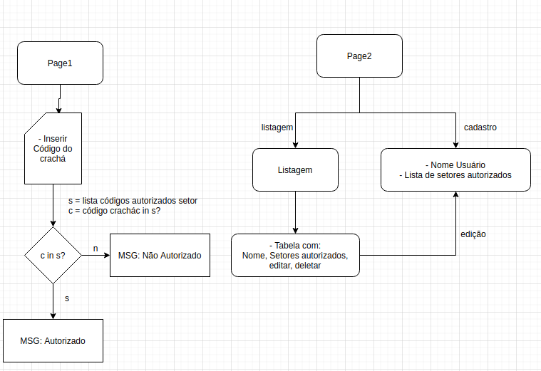
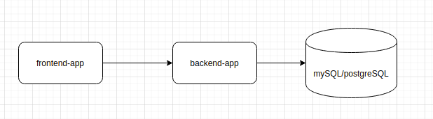

```

      ___           ___           ___                         ___     
     /  /\         /  /\         /  /\          ___          /  /\    
    /  /::|       /  /::\       /  /:/         /__/\        /  /::\   
   /  /:|:|      /  /:/\:\     /  /:/          \  \:\      /__/:/\:\  
  /  /:/|:|__   /  /:/  \:\   /  /:/            \__\:\    _\_ \:\ \:\ 
 /__/:/_|::::\ /__/:/ \__\:\ /__/:/     /\      /  /::\  /__/\ \:\ \:\
 \__\/  /~~/:/ \  \:\ /  /:/ \  \:\    /:/     /  /:/\:\ \  \:\ \:\_\/
       /  /:/   \  \:\  /:/   \  \:\  /:/     /  /:/__\/  \  \:\_\:\  
      /  /:/     \  \:\/:/     \  \:\/:/     /__/:/        \  \:\/:/  
     /__/:/       \  \::/       \  \::/      \__\/          \  \::/   
     \__\/         \__\/         \__\/                       \__\/    

```

# Frontend

- HTML5, CSS3 e ES6.
- Poderá ser usado Bootstrap 4+ para construir o layout.
- Não será permitido o uso de nenhuma biblioteca javascript, somente javascript puro.

Estrutura das páginas:



- Page1: Campo setor e campo codigo do usuário.

Duas respostas: Se o setor estiver habilitado para o usuario mostrar a mensagem: "Usuário Liberado". Caso não esteja "Usúario SEM permissão de acesso";

- Page2:

1) Listagem de todos os usuarios, com botão de editar e deletar
2) Cadastro/Edição dos usuarios, com: campo Nome do usuario, setores à liberar.


#### O que será avaliado:

- Fundamentos do javascript (arrow functions, callback functions, etc (ES6))
- Contexto de testes em navegadores (dica: cypress)
- Manipulação do DOM em tempo de execução
- Estruturação e hierarquia de arquivos

# Backend




- Crie backend in Node.js e conecte com um banco de dados mySql ou postgreSql
- Crie os endpoints simples para:

1) Edição do usuário
2) Remover Usuário
3) Incluir Usuário
4) Verificar acesso Usuário


# IMPORTANTE

- Crie um fork desde repositorio
- Ao finalizar o teste favor realizar um pull request para este repositorio.